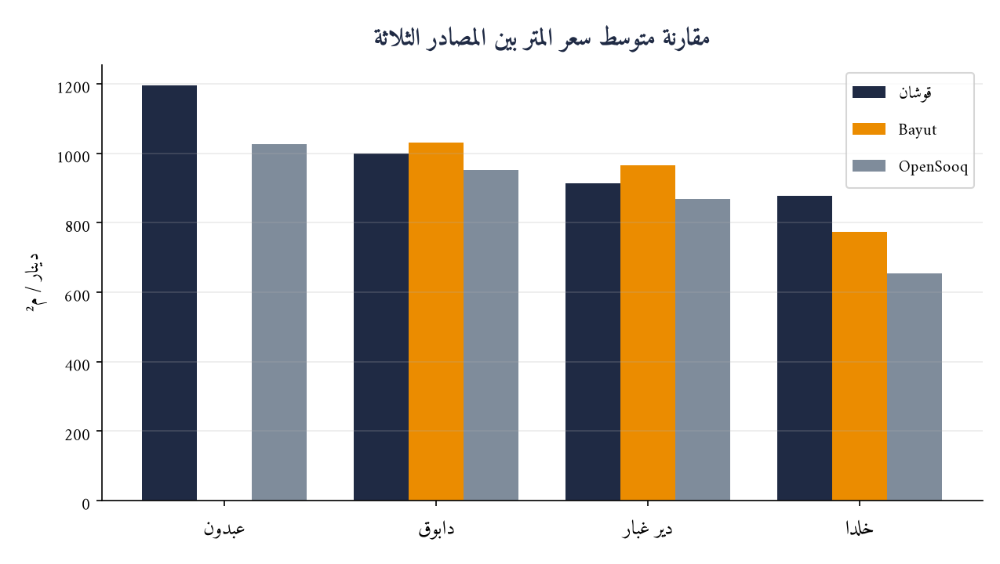

# دراسة تحليلية لأسعار متر الشقق السكنية في غرب عمّان
### تحليل سوقي مقارن لأربع مناطق رئيسية — عبدون، دابوق، دير غبار، خلدا

---

| | |
|---|---|
| **إعداد** | وحدة تحليل البيانات العقارية |
| **تاريخ الإصدار** | 21 يونيو 2026 |
| **النطاق الجغرافي** | محافظة عمّان — غرب العاصمة |
| **فئة الأصول** | الشقق السكنية المعروضة للبيع (باستثناء الفلل والأراضي والعقارات التجارية) |
| **حجم العيّنة** | 1,460 إعلاناً مسعّراً من 3 مصادر مستقلة |
| **تصنيف الوثيقة** | للاستخدام الاسترشادي |

---

## 1. الملخّص التنفيذي

أجرينا تحليلاً كمّياً لسعر المتر المربّع للشقق السكنية المعروضة للبيع في أربع من أبرز مناطق غرب عمّان، اعتماداً على **1,460 إعلاناً فعلياً** جُمعت من ثلاث منصّات عقارية مستقلة (قوشان، Bayut الأردن، السوق المفتوح). تهدف الدراسة إلى تكوين مرجع سعري موثوق يستند إلى بيانات السوق الحقيقية بدلاً من التقديرات العامة.

**أبرز المؤشرات:**

| المؤشر | القيمة |
|---|---|
| متوسط سعر المتر — الأعلى (عبدون) | **1,113 دينار/م²** |
| متوسط سعر المتر — الأدنى (خلدا) | **771 دينار/م²** |
| الفجوة السعرية بين الأعلى والأدنى | **44%** |
| حجم العيّنة الإجمالي | **1,460 شقة** |

> **الخلاصة:** تحافظ المناطق الأربع على تراتبية سعرية واضحة ومستقرّة عبر جميع المصادر — **عبدون** في القمّة، تليها **دابوق**، ثم **دير غبار**، وأخيراً **خلدا** — ما يعكس تموضعاً سوقياً راسخاً لكل منطقة.

---

## 2. المنهجية

### 2.1 مصادر البيانات
اعتمدت الدراسة على ثلاثة مصادر مستقلة لضمان التحقّق المتقاطع (Triangulation):

| المصدر | طبيعة البيانات | الدور في الدراسة |
|---|---|---|
| **قوشان (Qoshan)** | بيانات منظّمة (سعر + مساحة) | المصدر الأساسي للمناطق الأربع |
| **Bayut الأردن** | بيانات منظّمة عالية الجودة | تعزيز عيّنة دابوق ودير غبار وخلدا |
| **السوق المفتوح (OpenSooq)** | سعر دقيق + مساحة من نص الإعلان | المصدر الرئيسي لعبدون |

### 2.2 معالجة البيانات
1. **استخراج آلي** لروابط الإعلانات وبياناتها (السعر، المساحة، نوع العقار) مع ترقيم الصفحات بالكامل.
2. **التصفية الموضوعية:** الإبقاء على الشقق فقط، واستبعاد الفلل والقصور والأراضي والمزارع والعقارات التجارية عبر تصنيف دلالي للعناوين.
3. **ضبط الجودة:** استبعاد القيم الشاذة — حصر المساحة بين 40–1,500 م²، والسعر فوق 20 ألف دينار، وسعر المتر ضمن 150–5,000 دينار/م².
4. **تنقية البيانات:** استُبعدت مجموعة إعلانات حملت قيمة سعر/مساحة موحّدة منسوخة من إعلان مميّز (لا تطابق المساحات المعلنة في عناوينها)، تفادياً لتشويه المتوسط في المناطق محدودة العيّنة.
5. **اعتماد المتوسط (Median)** كمقياس مركزي رئيسي لمقاومته للقيم المتطرّفة، مع عرض المتوسط الحسابي والأرباع (Q1/Q3) لقياس التشتّت.

---

## 3. النتائج الرئيسية

### 3.1 لوحة الأسعار المجمّعة

| المنطقة | التصنيف | عدد الشقق | **متوسط سعر المتر** | المدى الرُّبعي (Q1–Q3) | نطاق سعر المتر |
|---|:---:|---:|---:|---:|---:|
| **عبدون** | فاخرة | 131 | **1,113 دينار/م²** | 879 – 1,280 | 454 – 2,547 |
| **دابوق** | فاخرة | 325 | **1,023 دينار/م²** | 874 – 1,224 | 340 – 1,714 |
| **دير غبار** | راقية | 512 | **926 دينار/م²** | 800 – 1,083 | 387 – 1,899 |
| **خلدا** | متوسطة-راقية | 492 | **771 دينار/م²** | 641 – 907 | 328 – 2,500 |

### 3.2 الشقة النموذجية لكل منطقة

| المنطقة | متوسط المساحة | متوسط السعر الإجمالي | الملف النموذجي |
|---|---:|---:|---|
| **عبدون** | 265 م² | 295,000 دينار | شقق واسعة فاخرة لشريحة الدخل المرتفع |
| **دابوق** | 250 م² | 270,000 دينار | شقق كبيرة في ضواحٍ راقية حديثة |
| **دير غبار** | 200 م² | 190,000 دينار | شقق عائلية متوازنة السعر/المساحة |
| **خلدا** | 200 م² | 155,000 دينار | الأنسب للأسر المتوسطة والشريحة الأوسع طلباً |

---

### 3.3 توزيع الأسعار ومقارنة المصادر

---

## 4. القراءات التحليلية

**1. تراتبية سعرية مستقرّة عبر المصادر.**
يتطابق ترتيب المناطق الأربع في كل مصدر يغطّيها: قوشان والسوق المفتوح يرتّبان المناطق الأربع جميعها بالترتيب نفسه، بينما يؤكّد Bayut الترتيب في المناطق الثلاث التي يغطّيها (دابوق، دير غبار، خلدا) — إذ لا يوفّر Bayut صفحة شقق مستقلة لعبدون. هذا الاتساق عبر المصادر المستقلة يمنح الترتيب درجة ثقة عالية، وتتصدّر عبدون بفارق يقارب **44%** عن خلدا في أدنى الترتيب.

**2. توافق مرتفع يعزّز الموثوقية.**
في **دير غبار** كان الفارق بين متوسط قوشان والمتوسط المجمّع نحو **13 ديناراً/م²** فقط، وفي **دابوق** نحو **23 ديناراً/م²** — تقارب لافت بين مصادر مستقلة يعزّز موثوقية التقدير.

**3. تصحيح سعري في خلدا بعد توسيع العيّنة.**
انخفض متوسط خلدا من **878** (قوشان وحده) إلى **771 دينار/م²** بعد ضمّ نحو 420 إعلاناً إضافياً — أي أن معروض قوشان في خلدا كان أعلى من متوسط السوق بنحو **14%**. هذه أهم نتيجة كشفها توسيع العيّنة.

**4. خلدا الأعلى تبايناً، عبدون الأعلى تجانساً نحو القمّة.**
يتّسع المدى الرُّبعي في خلدا (641–907) ليعكس تنوّع المعروض بين القديم والحديث، بينما تتركّز شقق عبدون في الشريحة العليا.

**5. علاقة عكسية بين السعر وعمق الطلب.**
كلما انخفض سعر المتر اتّسعت قاعدة المعروض والطلب: خلدا ودير غبار (أكثر من 500 إعلان لكلٍّ منهما) تمثّلان عمق السوق، بينما عبدون سوق نخبوي أضيق.

---

## 5. الدلالات الاستثمارية

| الشريحة المستهدفة | المنطقة المقترحة | المسوّغ |
|---|---|---|
| **السكن الفاخر / الاستثمار المرموق** | عبدون | أعلى قيمة لكل متر وأرسخ تموضع سوقي |
| **التطوير العقاري الراقي** | دابوق | مساحات كبيرة + سعر متر تنافسي نسبياً للفئة الفاخرة |
| **التوازن بين القيمة والموقع** | دير غبار | سعر معتدل وعمق طلب مرتفع |
| **الطلب السكني الأوسع / العائد الإيجاري** | خلدا | أدنى سعر متر وأكبر قاعدة معروض وطلب |

---

## 6. حدود الدراسة والتحفّظات

- الأسعار المعتمدة هي **أسعار عرض (مطلوبة)** وليست أسعار إغلاق فعلية، وقد تنطوي على هامش تفاوضي.
- قد توجد إعلانات مكرّرة بين المصادر المختلفة (لم يُجرَ دمج التكرار عبر المنصّات).
- المساحة في بيانات السوق المفتوح مستخرجة من نصّ الإعلان، ما يقلّص حجم عيّنته بعد التصفية.
- البيانات **لحظية** بتاريخ السحب وتتغيّر باستمرار مع حركة السوق.
- التحليل يقتصر على الشقق السكنية ولا يشمل الفلل أو الأراضي أو الأصول التجارية.

---

## 7. الملاحق

تتوفّر البيانات التفصيلية الداعمة لهذه الدراسة ضمن الملفات المرافقة:

- `qoshan-amman-top4-multisource.csv` — قاعدة البيانات الكاملة (1,460 شقة: المنطقة، المصدر، المساحة، السعر، سعر المتر).
- `qoshan-amman-top4-multisource.md` — جداول المقارنة التفصيلية لكل مصدر.
- `qoshan-amman-top4-apartments.md` — التحليل الإحصائي المعمّق (الأرباع، التوزيعات، جداول الإعلانات).

---

*إخلاء مسؤولية: أُعدّت هذه الوثيقة لأغراض تحليلية واسترشادية فقط، استناداً إلى بيانات معلنة مُتاحة للعموم. لا تشكّل توصية استثمارية أو تقييماً عقارياً رسمياً، ويُنصح بالتحقّق الميداني قبل اتخاذ أي قرار. جميع الأرقام تقريبية وتعكس وضع السوق بتاريخ الإصدار.*

