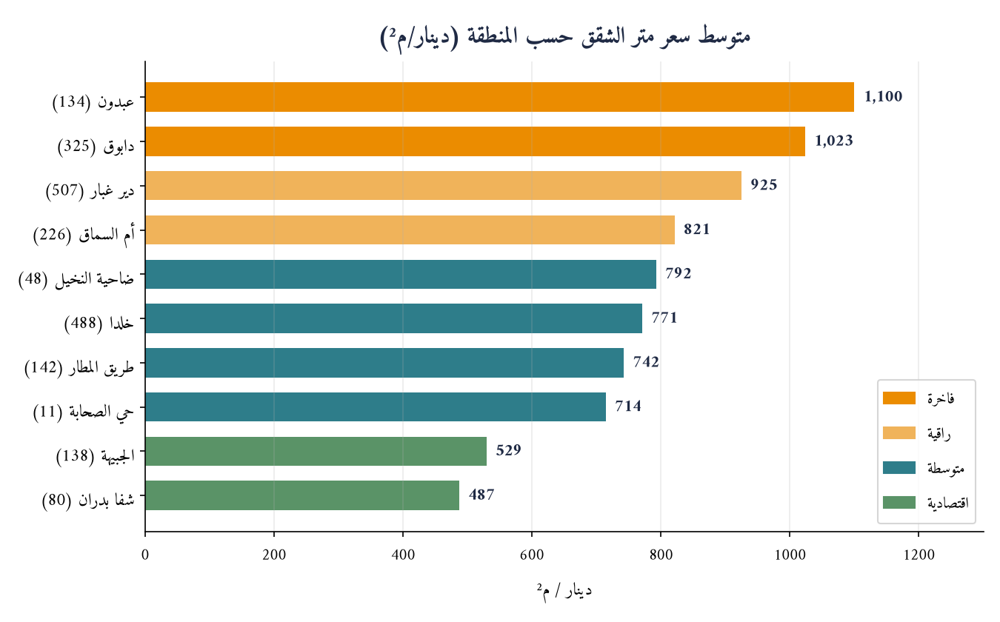
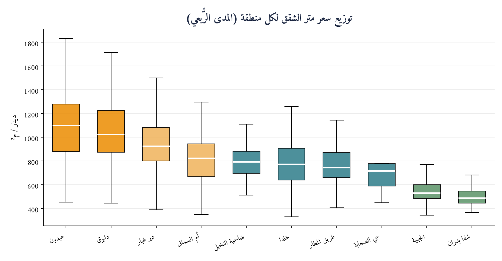

# دراسة تحليلية لأسعار متر الشقق السكنية في عمّان
### تحليل سوقي مقارن لعشر مناطق وضواحٍ — من عبدون إلى شفا بدران

---

| | |
|---|---|
| **إعداد** | وحدة تحليل البيانات العقارية |
| **تاريخ الإصدار** | 21 يونيو 2026 |
| **النطاق الجغرافي** | محافظة عمّان |
| **فئة الأصول** | الشقق السكنية المعروضة للبيع (باستثناء الفلل والأراضي والعقارات التجارية) |
| **حجم العيّنة** | 2,099 إعلاناً مسعّراً من 3 مصادر مستقلة |
| **تصنيف الوثيقة** | للاستخدام الاسترشادي |

---

## 1. الملخّص التنفيذي

أجرينا تحليلاً كمّياً لسعر المتر المربّع للشقق السكنية المعروضة للبيع في **عشر مناطق** بعمّان، اعتماداً على **2,099 إعلاناً فعلياً** جُمعت من ثلاث منصّات عقارية مستقلة (قوشان، Bayut الأردن، السوق المفتوح). تهدف الدراسة إلى تكوين مرجع سعري موثوق يستند إلى بيانات السوق الحقيقية بدلاً من التقديرات العامة.

**أبرز المؤشرات:**

| المؤشر | القيمة |
|---|---|
| متوسط سعر المتر — الأعلى (عبدون) | **1,100 دينار/م²** |
| متوسط سعر المتر — الأدنى (شفا بدران) | **487 دينار/م²** |
| الفجوة السعرية بين الأعلى والأدنى | **126%** |
| حجم العيّنة الإجمالي | **2,099 شقة** |

> **الخلاصة:** تتوزّع مناطق عمّان العشر على أربع شرائح سعرية واضحة، من **عبدون** في القمّة (~1,100 دينار/م²) إلى **شفا بدران** في القاعدة (~487 دينار/م²) — بفجوة تتجاوز الضِّعف، تعكس تبايناً جوهرياً في الموقع والطلب ومستوى التطوير.

---

## 2. المنهجية

### 2.1 مصادر البيانات
اعتمدت الدراسة على ثلاثة مصادر مستقلة لضمان التحقّق المتقاطع (Triangulation):

| المصدر | طبيعة البيانات | الدور في الدراسة |
|---|---|---|
| **قوشان (Qoshan)** | بيانات منظّمة (سعر + مساحة) | تغطية أساسية لمعظم المناطق |
| **Bayut الأردن** | بيانات منظّمة عالية الجودة | تعزيز العيّنة وتغطية الجبيهة |
| **السوق المفتوح (OpenSooq)** | سعر دقيق + مساحة من نص الإعلان | تغطية تكميلية شاملة |

### 2.2 معالجة البيانات
1. **استخراج آلي** لروابط الإعلانات وبياناتها (السعر، المساحة، نوع العقار) مع ترقيم الصفحات بالكامل.
2. **التصفية الموضوعية:** الإبقاء على الشقق فقط، واستبعاد الفلل والقصور والأراضي والمزارع والعقارات التجارية عبر تصنيف دلالي للعناوين.
3. **ضبط الجودة:** استبعاد القيم الشاذة — حصر المساحة بين 40–1,500 م²، والسعر فوق 20 ألف دينار، وسعر المتر ضمن 150–5,000 دينار/م².
4. **تنقية البيانات:** استُبعدت إعلانات حملت قيمة سعر/مساحة موحّدة منسوخة من إعلان مميّز، تفادياً لتشويه المتوسط في المناطق محدودة العيّنة.
5. **اعتماد المتوسط (Median)** كمقياس مركزي رئيسي لمقاومته للقيم المتطرّفة، مع عرض المتوسط الحسابي والأرباع (Q1/Q3) لقياس التشتّت.

---

## 3. النتائج الرئيسية

### 3.1 لوحة الأسعار المجمّعة

| # | المنطقة | الشريحة | عدد الشقق | **متوسط سعر المتر** | المدى الرُّبعي (Q1–Q3) | نطاق سعر المتر |
|---:|---|:---:|---:|---:|---:|---:|
| 1 | **عبدون** | فاخرة | 134 | **1,100 دينار/م²** | 878 – 1,280 | 454 – 2,547 |
| 2 | **دابوق** | فاخرة | 325 | **1,023 دينار/م²** | 874 – 1,224 | 340 – 1,714 |
| 3 | **دير غبار** | راقية | 507 | **925 دينار/م²** | 799 – 1,083 | 387 – 1,899 |
| 4 | **أم السماق** | راقية | 226 | **821 دينار/م²** | 667 – 944 | 349 – 1,296 |
| 5 | **ضاحية النخيل** | متوسطة | 48 | **792 دينار/م²** | 696 – 883 | 300 – 2,500 |
| 6 | **خلدا** | متوسطة | 488 | **771 دينار/م²** | 640 – 907 | 190 – 2,500 |
| 7 | **طريق المطار** | متوسطة | 142 | **742 دينار/م²** | 659 – 871 | 337 – 2,250 |
| 8 | **حي الصحابة** | متوسطة | 11 | **714 دينار/م²** | 589 – 778 | 448 – 1,154 |
| 9 | **الجبيهة** | اقتصادية | 138 | **529 دينار/م²** | 484 – 601 | 275 – 1,046 |
| 10 | **شفا بدران** | اقتصادية | 80 | **487 دينار/م²** | 443 – 547 | 244 – 995 |

### 3.2 التصنيف حسب الشريحة السعرية

- **🟥 فاخرة · ≥ 1,000 دينار/م²:** عبدون (1,100)، دابوق (1,023)
- **🟧 راقية · 800–999:** دير غبار (925)، أم السماق (821)
- **🟨 متوسطة · 700–799:** ضاحية النخيل (792)، خلدا (771)، طريق المطار (742)، حي الصحابة (714)
- **🟩 اقتصادية · < 700:** الجبيهة (529)، شفا بدران (487)

### 3.3 الشقة النموذجية لكل منطقة

| المنطقة | متوسط المساحة | متوسط السعر الإجمالي | الملف النموذجي |
|---|---:|---:|---|
| **عبدون** | 264 م² | 292,500 دينار | شقق واسعة فاخرة لشريحة الدخل المرتفع |
| **دابوق** | 250 م² | 270,000 دينار | شقق كبيرة في ضواحٍ راقية حديثة |
| **دير غبار** | 200 م² | 190,000 دينار | شقق عائلية متوازنة السعر/المساحة |
| **أم السماق** | 195 م² | 158,500 دينار | شقق راقية بموقع غربي مركزي |
| **ضاحية النخيل** | 205 م² | 165,000 دينار | شقق حديثة بأسعار تنافسية |
| **خلدا** | 200 م² | 155,000 دينار | الأنسب للأسر المتوسطة والشريحة الأوسع طلباً |
| **طريق المطار** | 200 م² | 150,000 دينار | شقق اقتصادية بمساحات مرنة |
| **حي الصحابة** | 195 م² | 145,000 دينار | منطقة سكنية ناشئة معقولة السعر |
| **الجبيهة** | 174 م² | 93,000 دينار | شقق اقتصادية قرب الجامعة الأردنية، طلب طلابي وعائلي |
| **شفا بدران** | 170 م² | 82,000 دينار | أدنى سعر متر، توسّع سكني شمالي |

### 3.4 توزيع الأسعار

---

## 4. القراءات التحليلية

**1. أربع شرائح سعرية متمايزة.** يتدرّج السوق من شريحة فاخرة (عبدون، دابوق فوق 1,000 دينار/م²) إلى شريحة اقتصادية (الجبيهة، شفا بدران دون 550)، بفجوة إجمالية **126%** تؤكد أن «سعر متر عمّان» مفهوم تتحكّم فيه المنطقة قبل أي عامل آخر.
**2. تماسك غرب عمّان في القمّة.** عبدون ودابوق ودير غبار وأم السماق (غرب العاصمة) تتصدّر، وتؤكّد المصادر المستقلة الثلاثة ترتيبها بتقارب لافت (أم السماق: قوشان 854، Bayut 824، السوق المفتوح 688).
**3. الجبيهة وشفا بدران: قيمة مقابل السعر.** أدنى سعر متر مع عيّنة كبيرة (الجبيهة 138، شفا بدران 80) — مناطق توسّع سكني شمالي بطلب طلابي وعائلي، مناسبة للعائد الإيجاري والميزانيات المتوسطة.
**4. التحقّق المتقاطع يعزّز الثقة.** في المناطق المغطّاة بأكثر من مصدر، تقاربت المتوسطات بشكل لافت (طريق المطار: 725/745/695؛ شفا بدران: 487/481) — ما يرفع موثوقية الترتيب.
**5. عمق السوق يتركّز في الشريحة المتوسطة.** خلدا ودير غبار وأم السماق وطريق المطار تجمع أكبر المعروض، وهي قلب الطلب الفعلي للأسر.

---

## 5. الدلالات الاستثمارية

| الشريحة المستهدفة | المناطق المقترحة | المسوّغ |
|---|---|---|
| **السكن الفاخر / الاستثمار المرموق** | عبدون، دابوق | أعلى قيمة لكل متر وأرسخ تموضع سوقي |
| **التوازن بين القيمة والموقع** | دير غبار، أم السماق | موقع غربي راقٍ بسعر أدنى من القمّة |
| **الطلب السكني الأوسع** | خلدا، ضاحية النخيل، طريق المطار | أكبر قاعدة معروض وطلب عائلي |
| **العائد الإيجاري / الميزانيات الاقتصادية** | الجبيهة، شفا بدران، حي الصحابة | أدنى سعر دخول وطلب إيجاري مرتفع |

---

## 6. حدود الدراسة والتحفّظات

- الأسعار **أسعار عرض (مطلوبة)** وليست أسعار إغلاق فعلية، وقد تنطوي على هامش تفاوضي.
- تتفاوت تغطية المصادر بين المناطق (مثلاً: الجبيهة بلا قوشان، وضاحية النخيل وحي الصحابة بلا Bayut)؛ روعي ذلك في القراءة.
- المساحة في بيانات السوق المفتوح مستخرجة من نصّ الإعلان، ما يقلّص حجم عيّنته بعد التصفية.
- حي الصحابة عيّنته صغيرة (11) فيُقرأ استرشاداً لا تعميماً.
- البيانات **لحظية** بتاريخ السحب وتتغيّر مع حركة السوق.

---

## 7. الملاحق

- `qoshan-amman-10areas-listings.csv` — قاعدة البيانات الكاملة (2,099 شقة: المنطقة، المصدر، المساحة، السعر، سعر المتر).
- `qoshan-amman-newareas-databank.md` — بنك معلومات المناطق الست المضافة.
- `qoshan-amman-top4-multisource.md` — تفصيل المناطق الأربع الأصلية.

---

*إخلاء مسؤولية: أُعدّت هذه الوثيقة لأغراض تحليلية واسترشادية فقط، استناداً إلى بيانات معلنة مُتاحة للعموم. لا تشكّل توصية استثمارية أو تقييماً عقارياً رسمياً، ويُنصح بالتحقّق الميداني قبل اتخاذ أي قرار. جميع الأرقام تقريبية وتعكس وضع السوق بتاريخ الإصدار.*

